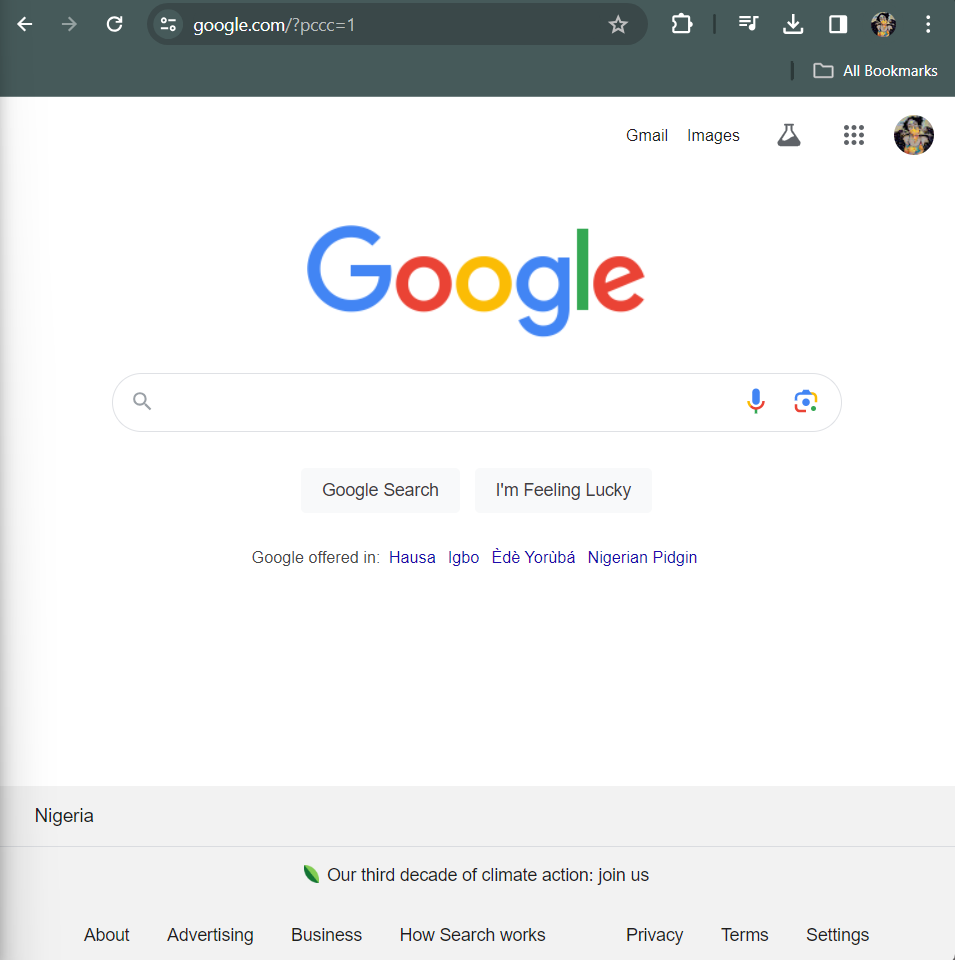
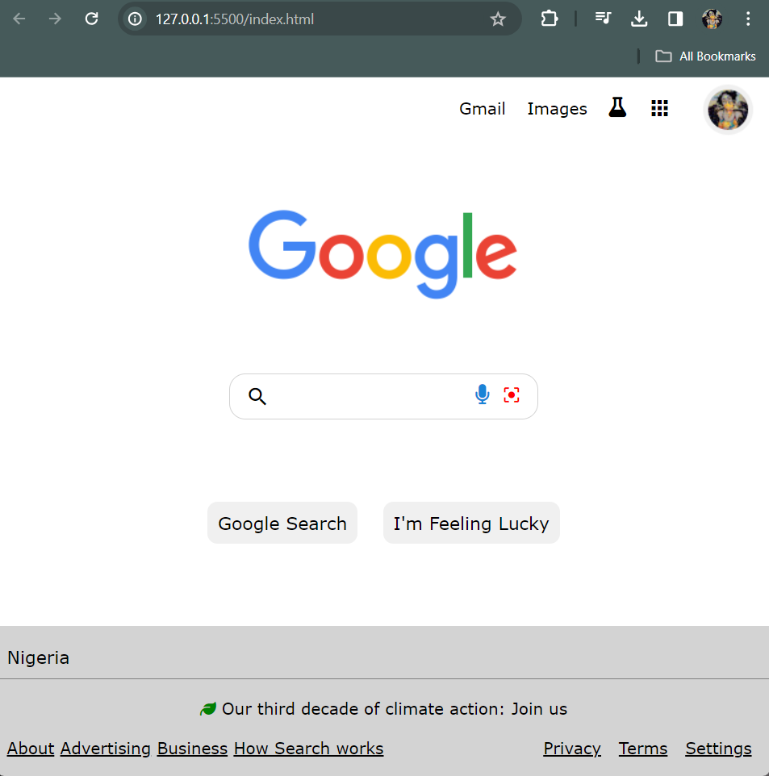

# Google-page-clone
## Overview
This project is a FOLLOW-ALONG Exercise given in the 2024 ZURI software development program.
The task was to clone the GOOGLE Homepage by following a tutorial on [YouTube by PamTech Coding](https://www.youtube.com/watch?v=480_ofnw6TY).

## What I learnt/Achieved
- I refreshed my basic knowlegde of Git.
- I gained a better understanding of using CSS FlexBox for alignment.

## Minor Tweaks
PamTech had a variation of Google Homepage she used for the tutorial. I also had my variation of Google Homepage i used to follow along which is [Google Nigeria](google.com.ng). Choosing this variation presented me with more challenges, which helped me along my learning path.

## Results
* A screenshot of the GOOGLE Homepage I attempted to clone:

* A screenshot of the GOOGLE clone I created.

